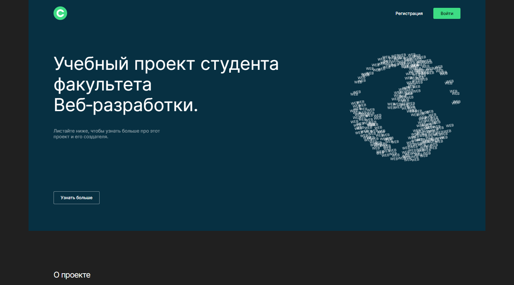

# Проект: Навигатор фильмов (frontend)

Дипломный проект выполненный в рамках курса "Веб-разработчик" от Яндекс Практикум. Проект представляет из себя фронтенд часть для проекта [Навигатор фильмов](https://github.com/Bjorn86/movies-explorer-api) также выполненного в рамках указанного выше учебного курса.

## Оглавление

- [Обзор проекта](#обзор-проекта)
  - [Информация для код-ревью](#информация-для-код-ревью)
  - [Задачи проекта](#задачи-проекта)
  - [Функциональность проекта](#функциональность-проекта)
  - [Screenshot](#screenshot)
  - [Директории проекта](#директории-проекта)
  - [Запуск проекта](#запуск-проекта)
  - [Ссылки](#ссылки)
- [Ход выполнения проекта](#ход-выполнения-проекта)
  - [Используемые технологии](#используемые-технологии)
  - [Чему я научился работая над проектом](#чему-я-научился-работая-над-проектом)
- [Автор](#автор)

## Обзор проекта

### Информация для код-ревью

- Временные файлы имитирующие информацию получаемую от API размещены в директории `src/temp/`
- Временный код имитирующие работу с API или работу с контекстом помечен комментарием `!TEMP: ...`
- Ошибки приходящие от сервера, которые по макету необходимо показывать на страницах редактирования профиля, логина, и регистрации, вынесены в компонент ServerErrors. В отсутствии возможности взаимодействия с API, самый длинный текст ошибки захардкоден. При наличии запрета на данном этапе работать с функционалом приложения, данную ошибку можно увидеть только на странице редактирования профиля, при нажатии на кнопку **"Редактировать"**.
- [Ссылка на макет проекта](https://disk.yandex.ru/d/59bt9dAe_qBJ8w)

### Задачи проекта

Проект был призван закрепить навыки frontend-разработки, фреймворка React, разработки SPA, и работе с React Router.

### Функциональность проекта

Функционально проект представляет из себя приложение для поиска фильмов как по названию так и формату (короткий метр / полный метр). У пользователя имеется возможность добавить понравившийся фильм в свою коллекцию сохранённых фильмов, при этом в коллекции сохранённых фильмов остаются указанные выше возможности поиска и фильтрации.

### Screenshot

### Директории проекта

- `src/components` — директория с компонентами
- `src/contexts` — директория с элементами контекста
- `src/hooks` — директория с пользовательскими хуками
- `src/images` — директория с файлами изображений
- `src/utils` — директория со вспомогательными файлами
- `src/vendor` — директория с файлами библиотек
  - `/fonts` — директория со шрифтами

### Запуск проекта

- `npm run build` — запуск проекта в режиме продакшн, с формированием файлов подготовленных к деплою в директории `/build`
- `npm start` — запуск проекта в режиме разработки

### Ссылки

- [Ссылка на репозиторий проекта](https://github.com/Bjorn86/movies-explorer-frontend)

## Ход выполнения проекта

### Используемые технологии

- HTML
- CSS
- JS
- [React](https://react.dev/)
- [React Router](https://reactrouter.com/en/main)
- [Create React App](https://create-react-app.dev/)
- Адаптивная вёрстка
- Семантическая вёрстка

### Чему я научился работая над проектом

## Автор

**Данила Легкобытов**

- e-mail: [legkobytov-danila@yandex.ru](mailto:legkobytov-danila@yandex.ru)
- Telegram: [@danila_legkobytov](https://t.me/danila_legkobytov)
- LinkedIn: [in/danila-legkobytov](https://www.linkedin.com/in/danila-legkobytov/)
